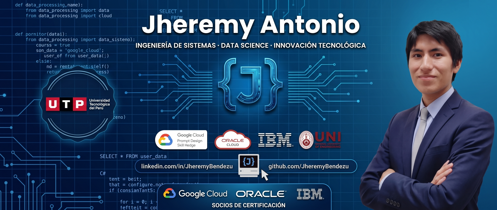

#  Hola, soy Jheremy Antonio Bendezu Ponce 👋
### Estudiante de Ingeniería de Sistemas e Informática | Apasionado por la Tecnología y la Innovación 

# 

Soy estudiante de Ingeniería de Sistemas e Informática en la **Universidad Tecnológica del Perú (UTP)** (perteneciente al décimo superior). Tengo conocimientos sólidos en herramientas tecnológicas, facilidad para el trabajo en equipos multidisciplinarios y aptitud para la gestión de proyectos. Mi objetivo es participar activamente en proyectos de tecnología, investigación, ciencia e innovación para generar un impacto positivo y sostenible en nuestro entorno.

---

## 🛠️ Tecnologías y Herramientas

**Lenguajes de Programación:**

**Desarrollo Web & Frameworks:**

**Bases de Datos & Data Science:**

**Herramientas & Entorno:**

---

## 🎓 Educación
- 🎓 **Ingeniería de Sistemas e Informática** - *Universidad Tecnológica del Perú (Mar 2024 - Mar 2029)*
- 📊 **Análisis de Datos con Power BI** - *Universidad Peruana de Ciencias Aplicadas (Ago 2025)*.
- 🤖 **Programas de Iniciación Tecnológica (PIT)** - *Universidad Nacional de Ingeniería (2025)*: Ciencia de Datos (1 y 2), Machine Learning con Python, SQL (Base de Datos 1 y 2), Programación en Python (Básico e Intermedio).
- 🗣️ **Inglés Básico / Intermedio** - *Asociación Cultural Peruano Británica (Británico)*.

---

## 🏆 Certificaciones Destacadas
- **Google Cloud:** Prompt Design in Vertex AI Skill Badge[cite: 4], Introduction to Vertex AI Studio[cite: 4], Introduction to Large Language Models[cite: 4], Gemini for DevOps Engineers[cite: 5, 6].
- **Oracle:** Cloud Infrastructure 2025 Certified AI Foundations Associate[cite: 2, 3].
- **IBM:** Cybersecurity Fundamentals[cite: 2].
- **MoureDev:** Python desde cero[cite: 1], Java y Programación Orientada a Objetos (POO) desde cero[cite: 1], Bash/Shell, terminal y línea de comandos desde cero[cite: 1, 2].
- **Alteryx:** Machine Learning Fundamentals Micro-Credential[cite: 5], Alteryx Foundational Micro-Credential[cite: 5, 6].
- **freeCodeCamp:** Foundational C# with Microsoft[cite: 6].
- **Santander Open Academy & BIG school:** Fundamentos de Chatgpt[cite: 3], Python[cite: 3, 4], Iniciación al Desarrollo con IA[cite: 2].
- **Corporación Grupo Romero:** Word Intermedio[cite: 3].

---

## ⚡ Sobre mí
- 💻 Me encanta optimizar mi entorno de trabajo utilizando herramientas como WSL Ubuntu, Warp y diseñando arquitecturas bajo principios SOLID.
- 🎵 En mi tiempo libre soy un apasionado de la cultura y el folklore; actualmente danzo Huaylas.
- 🎮 Para relajarme, disfruto jugar Dota 2 (siempre asumiendo los roles de support 4/5) y configurar servidores de Minecraft con mods personalizados.
- ⚽ También realizo diseño gráfico aficionado en Filmora, creando marcadores y portadas visuales para torneos de fútbol locales.
- 🏋️‍♂️ Mantengo un estilo de vida saludable combinando entrenamiento de fuerza con rutinas de running diarias.

---

## 📫 Contáctame:
## 📫 Contáctame:

